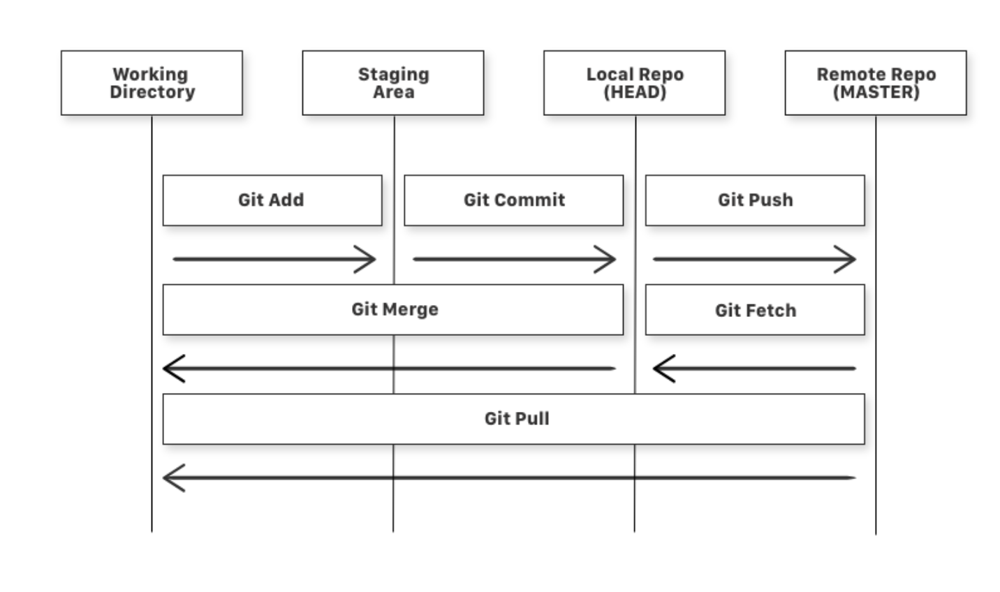

# Git Notes

## Basic Git Commands

* git add is a command used to add a file that is in the working directory to the staging area.
* git commit is a command used to add all files that are staged to the local repository.
* git push is a command used to add all committed files in the local repository to the remote repository. So in the remote repository, all files and changes will be visible to anyone with access to the remote repository.
* git fetch is a command used to get files from the remote repository to the local repository but not into the working directory.
* git merge is a command used to get the files from the local repository into the working directory.
* git pull is command used to get files from the remote repository directly into the working directory. It is equivalent to a git fetch and a git merge .
